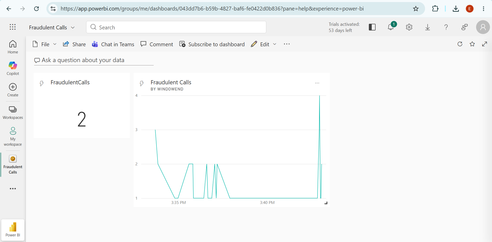
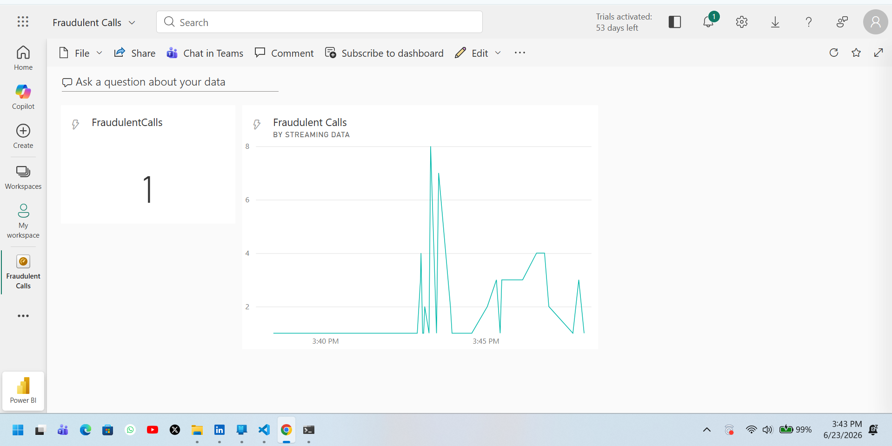
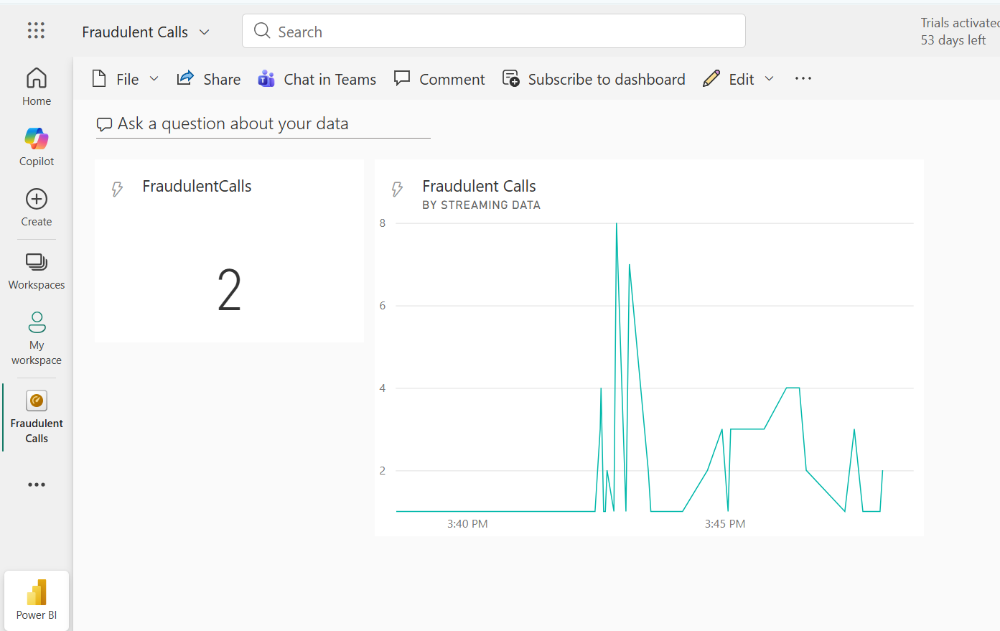
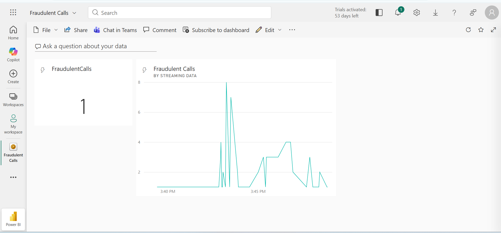
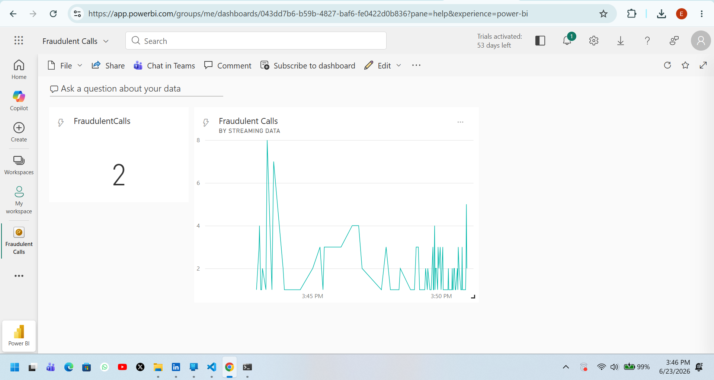
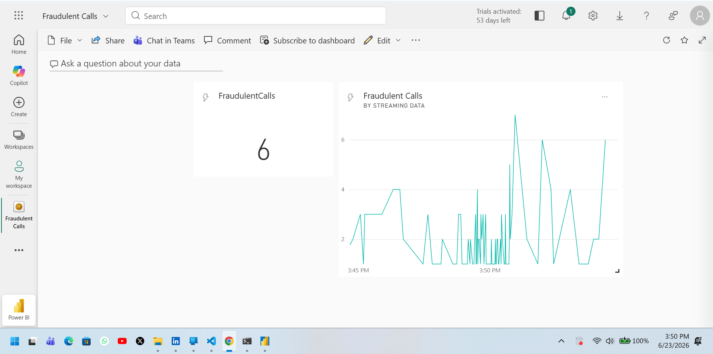
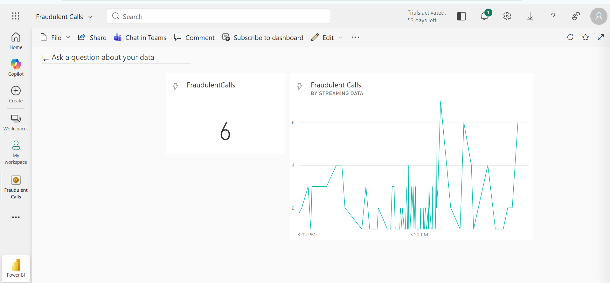
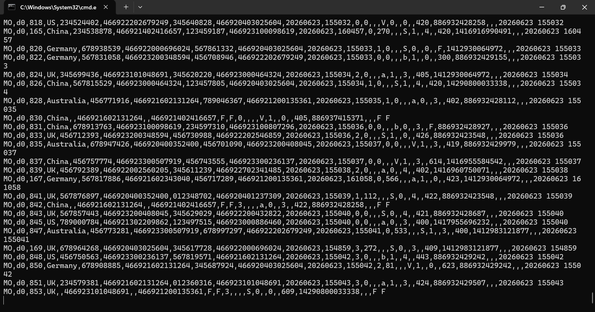
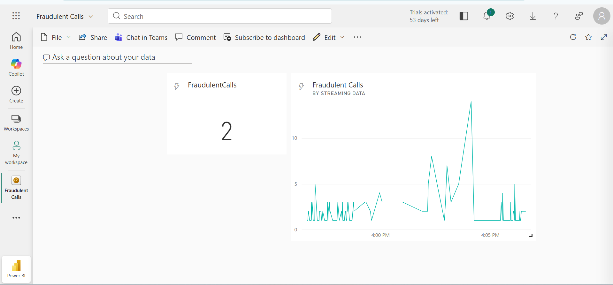

# Real-Time Telecom CDR Fraud Detection Pipeline

**A low-latency complex event processing (CEP) system that detects SIM-cloning and identity fraud in telecom networks by correlating Call Detail Records (CDRs) across geographically conflicting cell towers within sub-5-second windows.**

[](https://azure.microsoft.com/)
[](https://powerbi.microsoft.com/)
[]()

---

## Table of Contents

- [Business Problem](#business-problem)
- [Why This Matters](#why-this-matters)
- [Solution Overview](#solution-overview)
- [Architecture](#architecture)
- [Core Engineering Decisions](#core-engineering-decisions)
- [Data Schema](#data-schema)
- [Getting Started](#getting-started)
- [Repository Structure](#repository-structure)
- [Scaling to Production](#scaling-to-production)
- [Roadmap](#roadmap)

---

## Business Problem

Telecom carriers lose billions of dollars annually to subscriber identity fraud — most commonly **SIM cloning**, where an attacker duplicates a victim's International Mobile Subscriber Identity (IMSI) onto a second SIM card. Once cloned, the attacker's device can originate or receive calls under the victim's identity, simultaneously and from a different physical location.

This is not a billing inconvenience. It is the mechanism behind:

- **Revenue leakage** — fraudulent calls billed incorrectly or never billed at all, a problem the [GSMA estimates costs the global telecom industry tens of billions of dollars per year](https://www.gsma.com/) in unbilled and misrouted traffic.
- **Identity theft and account takeover** — cloned SIMs are a primary vector for intercepting one-time passwords (OTPs) and two-factor authentication codes, enabling downstream banking and account fraud.
- **Regulatory and compliance exposure** — carriers operating in regulated markets face fines and audit failures when fraud-detection controls cannot demonstrate real-time monitoring.
- **Customer churn** — subscribers who experience fraud on their line, or who are billed for calls they didn't make, lose trust in the carrier and leave.

The core technical difficulty is that **this fraud is only detectable in the moment it happens.** A cloned IMSI placing calls from two switches 2,000 km apart, 3 seconds apart, is unremarkable as an isolated record — fraud is only visible when one event is correlated against another event, in time, at scale, before the window closes. Batch analytics running on a nightly ETL cycle will catch this fraud a day too late, after the damage is billed, after the OTP is intercepted, after the account is drained.

## Why This Matters

This project exists to answer one specific, high-stakes question that batch systems cannot answer fast enough:

> **"Is the same subscriber identity currently active in two physically incompatible places at once?"**

That question only has value if it's answered in seconds, not hours. This is why the system is built as a **streaming-first, stateful CEP pipeline** rather than a traditional data warehouse job. It directly addresses three pain points that recur across telecom, fintech, and IoT fraud engineering:

1. **Latency-to-detection is the entire value proposition.** A fraud signal generated after the fraudulent call has already completed is a forensic record, not a control. This pipeline is designed to flag the anomaly inside the same temporal window the fraud occurs in.
2. **Naive joins don't scale to telecom call volume.** A brute-force comparison of every call against every other call is computationally unbounded. The system constrains the correlation to a strict, business-justified time window so the join stays performant under real network load.
3. **Out-of-order delivery is the norm, not the exception, in distributed telecom infrastructure.** Cell tower telemetry crosses radio links, backhaul networks, and ingestion queues before it reaches the cloud — and packets do not arrive in the order they were generated. A detection system that trusts cloud arrival time over device-logged time will produce false negatives and false positives under exactly the network jitter conditions fraud detection needs to be robust against.

In other words: this isn't a demo of "streaming is cool." It's a direct simulation of the architecture pattern carriers, payment processors, and IoT fleet operators actually need whenever the cost of a missed detection compounds every second it goes unflagged.

## Solution Overview

The pipeline ingests simulated CDR telemetry, performs a temporal self-join to find the same subscriber identity appearing on two conflicting network switches within an implausible travel window, and pushes confirmed anomalies to a live dashboard for analyst triage — end to end, in near real time, with no nightly batch step in the critical path.

## Architecture
Architecture

A synthetic data generator stands in for the carrier's cell tower network, producing CDR events at a sustained, high-throughput rate and pushing them over AMQP into Azure Event Hubs. Event Hubs is doing the unglamorous but critical job here: absorbing bursty, unpredictable arrival rates from thousands of concurrent "towers" without dropping records, and partitioning the stream so that downstream processing can scale horizontally rather than being bottlenecked behind a single consumer.

From there, Azure Stream Analytics reads continuously off the Event Hub and is where the actual fraud logic lives. ASA was chosen over a custom Spark Structured Streaming job or a hand-rolled Kafka Streams consumer specifically because the detection logic is a windowed self-join expressible in declarative SQL — ASA lets that logic be deployed, versioned, and reasoned about as a query rather than as a distributed application that someone has to operate, patch, and scale by hand. The job holds only the bounded state described in the engineering decisions below, runs the temporal self-join every second, and emits a row only when it finds a genuine conflict: the same CallingIMSI active on two different SwitchNum values inside a window too tight for legitimate travel.

Everything ASA emits  which, in normal operation, should be a tiny fraction of total call volume — is pushed as a live dataset directly into Power BI Service. This is the handoff point from engineering to the business, and it's worth being explicit about what that handoff is actually for.

## Downstream Use: From Detection to Decision

Flagging an anomaly is not the same as resolving it. The reason this pipeline ends in Power BI rather than, say, a log file or a database table, is that the people who act on a fraud signal are fraud analysts, not engineers — and they need to make a judgment call in seconds, not query a warehouse.

### 📊 Pipeline Operational Views & Live Dashboard
Below is the end-to-end evidence of the pipeline running successfully, from initial data ingestion to real-time analytics triage:

#### 1. Ingestion & Environment Architecture
* **Live Ingestion Telemetry:** Reviewing stream capacity, message arrivals, and partition distribution inside Azure Event Hubs.



#### 2. Complex Event Processing (CEP) Engine Configuration
* **Stream Analytics Configuration:** Validating inputs (`CallStream`) and mapping temporal boundary thresholds.



* **Query Engine Testing:** Deploying the optimized SQL self-join logic and measuring output generation under live loads.




#### 3. Analyst Triage Live Dashboard
* **Power BI Live Feed:** The operational interface displaying real-time fraud spikes, geographical routing switch conflicts, and high-risk subscriber lines flagged in sub-5-second intervals.



## Core Engineering Decisions

### 1. Complex Event Processing via Temporal Self-Join

The detection logic is a single, optimized Stream Analytics query that self-joins the call stream against itself, matching on subscriber identity and filtering for conflicting originating switches inside a tight time bound:

```sql
SELECT
    System.Timestamp AS WindowEnd,
    COUNT(*) AS FraudulentCalls
INTO [MyPBIOutput]
FROM [CallStream] CS1 TIMESTAMP BY CallRecTime
JOIN [CallStream] CS2 TIMESTAMP BY CallRecTime
    ON CS1.CallingIMSI = CS2.CallingIMSI
    AND DATEDIFF(ss, CS1, CS2) BETWEEN 1 AND 5
WHERE CS1.SwitchNum != CS2.SwitchNum
GROUP BY TumblingWindow(Duration(second, 1))
```

**Why a self-join, and why bound it to 1–5 seconds:** An unbounded join across the full stream would require the engine to retain unbounded state — every call, forever, waiting for a potential match. That's not viable at carrier scale. Bounding the join to a window that is *physically implausible to travel between two switches* (1–5 seconds) turns an open-ended correlation problem into a constant-memory, constant-latency operation. The window width is a business rule encoded directly into the query: it's the answer to "how fast would someone have to travel for this to be legitimate?"

### 2. Application Time vs. Arrival Time

```sql
TIMESTAMP BY CallRecTime
```

**Why this matters:** Stream Analytics can window events by the time they arrived in the cloud (Arrival Time) or by the time the source device logged them (Application Time). Telecom backhaul links introduce variable jitter — a call logged at a tower can arrive at Event Hubs milliseconds or seconds later, and two related calls can arrive *out of the order they happened in*. Windowing on Arrival Time would let network jitter masquerade as — or mask — fraud. Forcing the engine to window on `CallRecTime` (the device-logged timestamp) keeps the correlation anchored to physical reality regardless of ingestion-layer noise, which is the difference between a detection system that's robust under real network conditions and one that only works in a clean demo.

### 3. Constrained State, Not Unbounded State

The `GROUP BY TumblingWindow(Duration(second, 1))` combined with the bounded `DATEDIFF` predicate is a deliberate constraint: it keeps the job's internal state bounded and predictable, which is what allows it to run continuously, indefinitely, without the operator having to provision for ever-growing memory — a non-negotiable requirement for any job meant to run 24/7 in production.

## Data Schema

The data generator populates Event Hubs with the following CDR payload:

| Field | Type | Description |
|---|---|---|
| `CallRecTime` | DateTime (ISO 8601) | Application-layer event time — when the call was logged at the device/switch |
| `SwitchNum` | String | Originating cellular routing switch (e.g., `US`, `UK`, `AU`) |
| `CallingNum` | String | Subscriber MSISDN (phone number) |
| `CallingIMSI` | String | International Mobile Subscriber Identity — the primary join key for identity correlation |
| `CalledNum` | String | Destination party phone number |

## Getting Started

> Replace the placeholders below with your actual setup steps, connection strings, and resource names before publishing.

### Prerequisites
- An active Azure subscription
- Azure Event Hubs namespace + hub provisioned
- Azure Stream Analytics job provisioned
- Power BI account with permission to create push datasets
- [Your data generator's runtime — e.g., Python 3.x / .NET / Node]

### Setup
1. Clone this repository.
2. Provision an Event Hub and note the connection string.
3. Configure the data generator with your Event Hub connection details and run it to begin streaming simulated CDRs.
4. In Azure Stream Analytics, create an input pointing at your Event Hub and an output pointing at your Power BI workspace.
5. Deploy the self-join query from [`/query/fraud_detection.sql`](./query/fraud_detection.sql) and start the job.
6. Open the Power BI dashboard to view flagged anomalies as they're detected.

## Repository Structure

```
/                       Root infrastructure configuration
├── .gitignore          Excludes *.config / *.exe to keep infra secrets out of source control
├── generator/          Simulated CDR telemetry producer
├── query/              Stream Analytics CEP query definitions
└── dashboard/          Power BI dataset/report definitions
```

## Scaling to Production

If adapting this for a multi-million-subscriber environment:

- **Throughput parallelization:** Match Event Hub partition counts to allocated Stream Analytics Streaming Units (SUs) for linear horizontal scaling.
- **Cold-path analytics:** Add a secondary sink writing raw and flagged events to ADLS Gen2 as Snappy-compressed Parquet, enabling long-term fraud-pattern analysis and ML model training on top of the same stream.
- **Identity isolation:** Replace connection-string auth with Azure Managed Identities and RBAC, removing long-lived secrets from the pipeline entirely.
- **Alert routing:** Extend the Power BI sink with a parallel output to Azure Functions / Logic Apps to trigger automatic account suspension or analyst paging on high-confidence detections, rather than relying solely on dashboard triage.

## Roadmap

- [ ] Add a confidence/severity score rather than a binary flag (e.g., weight by switch distance vs. elapsed time)
- [ ] ML-based anomaly scoring on the ADLS Gen2 cold path to catch fraud patterns beyond the fixed-window rule
- [ ] Automated suspension workflow via Azure Functions on high-confidence detections
- [ ] Load testing harness to validate SU-to-partition scaling assumptions at simulated carrier volume